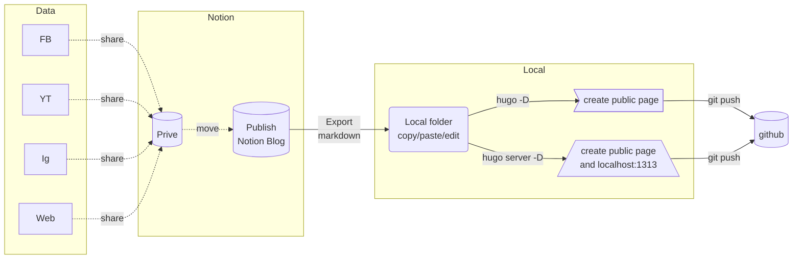

當我Notion寫的Blog數量越來越多，然後稀爛的SEO…
轉而尋找`可掛SEO、免費、markdown` 的Blog解決方案

**`Hugo`+`gh-page` 是一個開源，且完全符合，又可以調整style的方案**

未來的編輯流程

```mermaid
graph LR
Pr[(Prive)] -. move .->Pb[(Publish
Notion Blog)]

Pb-->|Export
markdown|B(Local folder
copy/paste/edit)-->|hugo -D|C>create public page]-->|git push|G[(github)]
B-->|hugo server -D|D[/
create public page
and localhost:1313\]-->|git push|G
 

subgraph Notion
    Pr 
    Pb
end

subgraph Local
  B
  C
  D
end

subgraph Data
  FB
  YT
  Ig
  Web
end

FB-.share.->Pr
YT-.share.->Pr
Ig-.share.->Pr
Web-.share.->Pr
```

從 2024/10/25 起開始搬家吧

[1.Use git page host Hugo blog]